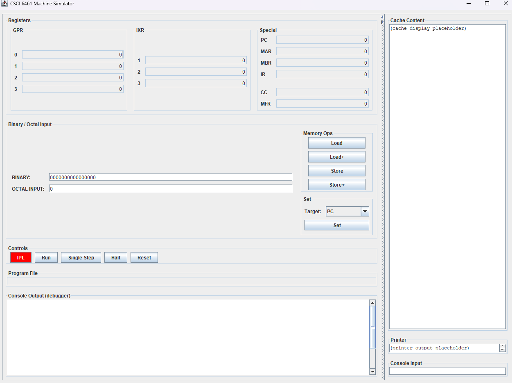

# Assembly Project for CSCI 6461
- Group 9
- Project using Windows 11 OS

## Prerequisites for Running
- Java (JDK 1.8 or later)
- Git
- Any CLI provided by windows

## Part 1 Overview
- Goal: Implementing GUI and simulator backend

## Project Structure
```
CSCI6461_GROUP9_PROJECT/
├─ .vscode/
├─ docs/
│  ├─ design_notes
│  ├─ images/
│  ├─ part1_test cases/
├─ lib/
├─ out/
├─ src/
│  ├─ part0_assembler/
│  │  ├─ assembler/
│  │  │  ├─ AsmLine.java
│  │  │  ├─ Assembler.java
│  │  │  ├─ ListingWriter.java
│  │  │  ├─ LoadWriter.java
│  │  │  ├─ NumberUtil.java
│  │  │  ├─ SymbolTable.java
│  │  │  └─ Tokenizer.java
│  │  ├─ tests/
│  │  │  ├─ encoder_test.java
│  │  │  └─ opcode_table_test.java
│  │  ├─ AssemblerMain.java
│  │  ├─ Encoder.java
│  │  ├─ opcode_table.java
│  │  └─ test.asm
│  ├─ simulator/
│  │  ├─ control/
│  │  │  └─ Controller.java
│  │  ├─ cpu/
│  │  │  └─ CPU.java
│  │  ├─ io/
│  │  │  └─ ProgramLoader.java
│  │  ├─ machine/
│  │  │  ├─ MachineState.java
│  │  │  ├─ Memory.java
│  │  │  └─ MemoryTest.java
│  │  └─ ui/
│  │     └─ GUI.java
│  └─ Main.java
└─ txt/
   ├─ test_listing.txt
   └─ test_load.txt

CSCI6461_Group9_Project.jar
README.md
```

## How to build (Windows powershell specific)
`javac -d out (Get-ChildItem src -Recurse -Filter *.java).FullName` <br>
Compiles all source files under `/src/` into `/out/` directory

## How to run
Assembler is packaged as a runnable JAR
With any Windows CLI:
1. Navigate to location to save repository
2. Navigate to project root directory
3. Clone repository `https://github.com/lgonza32/CSCI6461_Group9_Project.git` or unzip and save into directory.
4. Run the assembler using `java -jar CSCI6461_Group9_Project.jar`
<br>\ This executes the compiled `Main.java`, which automatically opens/runs GUI.

## Load File Format
Within /txt/test_load.txt and /txt/test_listing.txt produced by test.asm through assembler.
- Left = memory address (octal)
- Right = 16 bit word (octal)
<br>E.g. of load.txt
```
000006 000012
```
E.g. of listing.txt
```
000006  000012  Data 10 ;PUT 10 AT LOCATION 6
```

## Output Example
When running the JAR, the program should open a GUI. Something like this: <br>


## GUI Overview
Registers displays:
- GPR: R0–R3
- IXR: X1–X3
- Special Reg: PC, MAR, MBR, IR, CC, MFR \
<br> Binary/Octal Input:
- Binary field: accepts only 0/1 and is limited to 16 bits
- Octal field: accepts octal digits (0–7)
- Used by the Set Target panel and manual deposit/examine workflows.
- Values are displayed in octal (6 digits for 16-bit style display) \
<br> Set Target Register:
- Use dropdown target: PC, MAR, MBR, R0-R3, X1-X3
- Press Set to write the value to the selected target \
<br> Memory Ops:
- Load: MBR <- MEM[MAR]
- Load+: Load then MAR++
- Store: MEM[MAR] <- MBR
- Store+: Store then MAR++
- Cache Content panel shows the memory line at MAR (or a dump after IPL) \
<br> Controls:
- IPL (red): choose a *_load.txt file and load into memory
- Single Step: executes one instruction cycle (fetch/decode/execute)
- Reset: clears registers + memory
- Run / Halt: may be stubbed

## Test Run Examples (Also within the /docs/part1_test cases folder)
Enter a value into a register (R0-R3):
- Type value in Octal (e.g., 12) or Binary (e.g., 0000000000001010)
- Target dropdown → R0
- Click Set
- Verify R0 updates in the register display \
<br> Deposit a word into memory via "switches":
- Target → MAR, set address (e.g., octal 7), click Set
- Target → MBR, set data (e.g., octal 777), click Set
- Click Store
- Click Load to verify the value returns into MBR \
<br> Set PC and single step:
- Target → PC, enter address, click Set
- Click Single Step
- Observe IR update and any opcode effects \
<br> IPL:
- Click IPL and select /txt/test_load.txt (provided)
- PC will automatically move to program start (e.g., 000016) based on listing
- Click Single Step repeatedly to observe:
- LDX, LDR, LDA, JZ, and final HLT
- When halted, the console logs that CPU is halted and ignores further steps

## Summary
To use:
1. Clone repository: `https://github.com/lgonza32/CSCI6461_Group9_Project.git`
2. Compile project `javac -d out (Get-ChildItem src -Recurse -Filter *.java).FullName`
3. Run packaged JAR `java -jar CSCI6461_Group9_Project.jar`
4. Review GUI Overview and Test Examples for how-to-use

