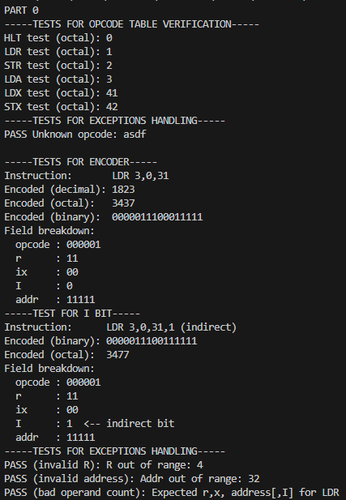

# Assembly Project for CSCI 6461
- Group 9
- Project using Windows 11 OS

## Prerequisites for Running
- Java (JDK 1.8 or later)
- Git
- Any provided by windows

## Part 0 Overview
- Under part0_assembler
- Goal: Implementing instruction translation through converting assembly instructions as documented in the ISA into 16-bit machine instructions and printed in octal.
- Additional information as noted in Design Notes

## Project Structure
```
src/
  part0_assembler/
     ├─ Encoder.java
     ├─ opcode_table.java
     ├─ part0_test.asm (test case deliverable)
     ├─ part0_listing.txt (listing file for the test case)
     └─ tests/
         ├─ encoder_test.java
         └─ opcode_table_test.java
  Main.java  

part0_assembler.jar
```

## How to build (Windows powershell specific)
`javac -d out (Get-ChildItem src -Recurse -Filter *.java).FullName`
Compiles all source files under `/src/` into `/out/` directory

## How to run
Assembler is packaged as a runnable JAR
With any Windows CLI:
1. Navigate to location to save repo
2. Clone repository `https://github.com/lgonza32/CSCI6461_Group9_Project.git`
3. Run `java -jar CSCI6461_Group9_Project`
This executes the compiled `Main.java`, which automatically runs all tests found within the test folder.

## Test Case
`part0_test.asm`
Assembly test case for part 0 for project deliverable
```
LOC 6
LDR 3,0,31
LDR 3,0,31,1
```

## Listing File
`part0_listing.txt`
Assembler listing output for test case
- listing values produced using encoder output printed by the tests executed in `Main.java`
```
ADDR     CODE     SOURCE
000006   003437   LDR 3,0,31
000007   003637   LDR 3,0,31,1
```
- `ADDR`: intended load address in octal (from `LOC`)
- `CODE`: 16-bit machine instruction in octal
- `SOURCE`: original assembly instruction

## Output Example
When running the JAR, the program should print something like this: <br>


## Summary
To use:
1. Clone repository: `https://github.com/lgonza32/CSCI6461_Group9_Project.git`
2. Compile project `javac -d out (Get-ChildItem src -Recurse -Filter *.java).FullName`
3. Run packaged JAR `java -jar CSCI6461_Group9_Project`
4. Review output and the provided part0_listing.txt

