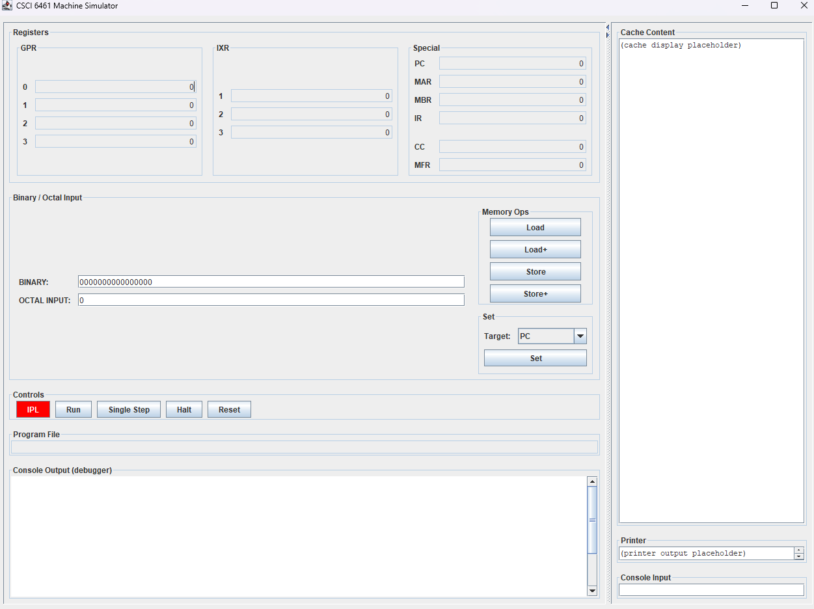

# Assembly Project for CSCI 6461
- Group 9
- Project using Windows 11 OS

## Prerequisites for Running
- Java (JDK 1.8 or later)
- Git
- Any CLI provided by windows

## Part 2 Overview
- Goal: Implementing GUI and simulator backend

## Project Structure
```
CSCI6461_GROUP9_PROJECT/
├─ .vscode/
├─ docs/
│  ├─ design_notes
│  ├─ images/
│  ├─ part1_test cases/
├─ lib/
├─ out/
├─ src/
│  ├─ part0_assembler/
│  │  ├─ assembler/
│  │  │  ├─ AsmLine.java
│  │  │  ├─ Assembler.java
│  │  │  ├─ ListingWriter.java
│  │  │  ├─ LoadWriter.java
│  │  │  ├─ NumberUtil.java
│  │  │  ├─ SymbolTable.java
│  │  │  └─ Tokenizer.java
│  │  ├─ tests/
│  │  │  ├─ encoder_test.java
│  │  │  └─ opcode_table_test.java
│  │  ├─ AssemblerMain.java
│  │  ├─ Encoder.java
│  │  ├─ opcode_table.java
│  │  └─ test.asm
│  ├─ simulator/
│  │  ├─ control/
│  │  │  └─ Controller.java
│  │  ├─ cpu/
│  │  │  └─ CPU.java
│  │  ├─ io/
│  │  │  └─ ProgramLoader.java
│  │  ├─ machine/
│  │  │  ├─ MachineState.java
│  │  │  ├─ Memory.java
│  │  │  └─ MemoryTest.java
│  │  └─ ui/
│  │     └─ GUI.java
│  └─ Main.java
└─ txt/
   ├─ test_listing.txt
   └─ test_load.txt

CSCI6461_Group9_Project.jar
README.md
```

## How to build (Windows powershell specific)
`javac -d out (Get-ChildItem src -Recurse -Filter *.java).FullName` <br>
Compiles all source files under `/src/` into `/out/` directory

## How to run
Assembler is packaged as a runnable JAR
With any Windows CLI:
1. Navigate to location to save repository
2. Navigate to project root directory
3. Clone repository `https://github.com/lgonza32/CSCI6461_Group9_Project.git` or unzip and save into directory.
4. Run the assembler using `java -jar CSCI6461_Group9_Project.jar`
<br>\ This executes the compiled `Main.java`, which automatically opens/runs GUI.

## Assembling Any .asm file
```
java -cp out part0_assembler.AssemblerMain <path to .asm file>
Example for Program1.asm:
java -cp out part0_assembler.AssemblerMain src/programs/program1/Program1.asm
```
This generates a listing file and load file in /txt/ used for simulator

## Output Example
When running the JAR, the program should open a GUI. Something like this: <br>


## GUI Overview
Registers displays:
- GPR: R0–R3
- IXR: X1–X3
- Special Reg: PC, MAR, MBR, IR, CC, MFR \
<br> Binary/Octal Input:
- Binary field: accepts only 0/1 and is limited to 16 bits
- Octal field: accepts octal digits (0–7)
- Used by the Set Target panel and manual deposit/examine workflows.
- Values are displayed in octal (6 digits for 16-bit style display) \
<br> Set Target Register:
- Use dropdown target: PC, MAR, MBR, R0-R3, X1-X3
- Press Set to write the value to the selected target \
<br> Memory Ops:
- Load: MBR <- MEM[MAR]
- Load+: Load then MAR++
- Store: MEM[MAR] <- MBR
- Store+: Store then MAR++
- Cache Content panel shows the memory line at MAR (or a dump after IPL) \
<br> Controls:
- IPL (red): choose a *_load.txt file and load into memory
- Single Step: executes one instruction cycle (fetch/decode/execute)
- Reset: clears machine state and restart from a clean state
- Run: execute the loaded program
- Halt: stop execution
<br> Console and Printer:
- Console Input is used for user input to programs
- Printer displays output generated by the simulator

## How to Load and Run a Program
1. Start the simulator GUI
2. Click IPL
3. Selected the generated *_load.txt from the /txt/ folder
4. The simulator loads the file into memory and sets the PC to the start address from the listing when available.
5. Type input into the Console (test cases provided in docs/part2_test_cases/)
6. Use Run or Single Step to execute the program

## How to Inspect Program Results
1. Set MAR to the octal memory location you want to inspect
2. Click Load
3. Read the Value in MBR
4. Use Load+ to inspect consecutive memory locations

## Program 1 Workflow
1. Assemble src/programs/program1/Program1.asm
2. Launch GUI `java -jar CSCI6461_Group9_Project.jar`
3. IPL txt/Program1_load.txt
4. Enter Program 1 input sequence into Console Input (sequences found in docs/part2_test_cases/)
5. Click Run
6. Inspect printer output and memeory location as needed

