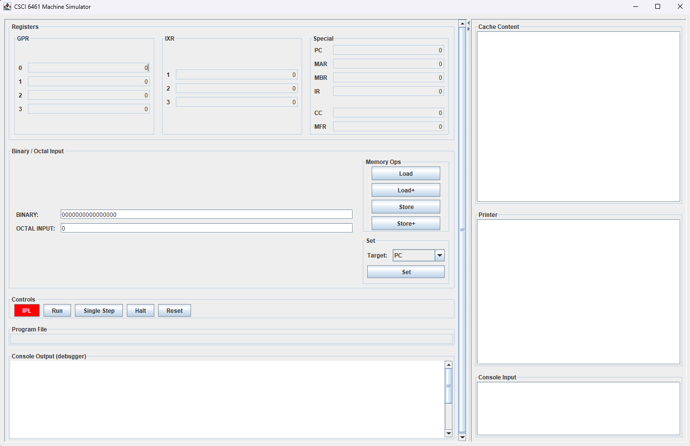

# Assembly Project for CSCI 6461
- Group 9
- Project using Windows 11 OS

## Prerequisites for Running
- Java (JDK 1.8 or later)
- Git
- Any CLI provided by windows

## Part 3 Overview
- Finish the remaining required instructions for this part, especially CHK and TRAP.
- Run Program 2 on the simulator from a machine-code load file. 
- Make sure the simulator can search a paragraph for a word and print the correct result. 
- Design notes located in `/docs/design_notes/Group 9 Project Pt 3 Design Notes.pdf`

## Project Structure
```
CSCI6461_GROUP9_PROJECT/
├─ .vscode/
├─ docs/
│  ├─ design_notes
│  │  │  └─ Group 9 Project Pt 3 Design Notes.pdf
│  ├─ images/
│  ├─ part1_test cases/
│  ├─ part2_test cases/
│  └─ part2_test cases/
├─ lib/
├─ out/
├─ src/
│  ├─ part0_assembler/
│  │  ├─ assembler/
│  │  ├─ tests/
│  │  ├─ AssemblerMain.java
│  │  ├─ Encoder.java
│  │  └─ opcode_table.java
│  ├─ simulator/
│  │  ├─ control/
│  │  ├─ cpu/
│  │  ├─ io/
│  │  ├─ machine/
│  │  ├─ ui/
│  │  └─ test/
│  │    ├─ InstructionTests.java
│  │    └─ MemoryTest.java
│  ├─ programs/
│  │  ├─ program1/
│  │  └─ program2/
│  │     └─ Program2.asm/
│  └─ Main.java
└─ txt/
   └─ <asm listings and loads>

CSCI6461_Group9_Project.jar
README.md
```

## How to build (Windows powershell specific)
`javac -d out (Get-ChildItem src -Recurse -Filter *.java).FullName` <br>
Compiles all source files under `/src/` into `/out/` directory

## Assembling Any .asm file
```
java -cp out part0_assembler.AssemblerMain <path to .asm file>
Example for Program2.asm:
java -cp out part0_assembler.AssemblerMain src/programs/program1/Program2.asm
```
This generates a listing file and load file in /txt/ used for simulator

## Output Example
When running the JAR, the program should open a GUI. Something like this: <br>


## GUI Overview
Registers displays:
- GPR: R0–R3
- IXR: X1–X3
- Special Reg: PC, MAR, MBR, IR, CC, MFR \
<br> Binary/Octal Input:
- Binary field: accepts only 0/1 and is limited to 16 bits
- Octal field: accepts octal digits (0–7)
- Used by the Set Target panel and manual deposit/examine workflows.
- Values are displayed in octal (6 digits for 16-bit style display) \
<br> Set Target Register:
- Use dropdown target: PC, MAR, MBR, R0-R3, X1-X3
- Press Set to write the value to the selected target \
<br> Memory Ops:
- Load: MBR <- MEM[MAR]
- Load+: Load then MAR++
- Store: MEM[MAR] <- MBR
- Store+: Store then MAR++
- Cache Content panel shows the memory line at MAR (or a dump after IPL) \
<br> Controls:
- IPL (red): choose a *_load.txt file and load into memory
- Single Step: executes one instruction cycle (fetch/decode/execute)
- Reset: clears machine state and restart from a clean state
- Run: execute the loaded program
- Halt: stop execution \
<br> Console and Printer:
- Console Input is used for user input to programs
- Printer displays output generated by the simulator

## How to Load and Run a Program
1. Start the simulator GUI
2. Click IPL
3. Selected the generated *_load.txt from the `/txt/` folder
4. The simulator loads the file into memory and sets the PC to the start address from the listing when available.
5. Type input into the Console (test cases provided in `/docs/part3_test_cases/`)
6. Use Run or Single Step to execute the program

## How to Inspect Program Results
1. Set MAR to the octal memory location you want to inspect
2. Click Load
3. Read the Value in MBR
4. Use Load+ to inspect consecutive memory locations

## InstructionTests.java
`InstructionTests.java` is the main instruction-level test file for the simulator.

Use it to:
- verify individual instructions
- check CPU changes after edits
- catch regressions before running full assembly programs

### Run the tests
1. Compile first
2. Run `java -cp out simulator.tests.InstructionTests` for instructions.

## Program 2 Workflow
1. Assemble `/src/programs/program1/Program2.asm`
2. Launch GUI `java -jar CSCI6461_Group9_Project.jar`
3. IPL `/txt/Program2_load.txt`
4. Click Run
5. Enter Program 2 example tests into Console Input when prompted (sequences found in `/docs/part3_test_cases/`)
6. Inspect printer output and memeory location as needed

## Expected Output for InstructionTests.java
```
=====================================================
Processor Control Tests
=====================================================
[PASS] HLT - CPU should halt and advance PC after fetching HLT
[PASS] Step ignored after HLT - Second step should be ignored when CPU is halted
[PASS] TRAP - TRAP should save return PC and jump to handler.
[PASS] TRAP illegal code - Illegal TRAP code should fault or halt.

=====================================================
Load / Store Tests
=====================================================
[PASS] LDR direct - R1 should load MEM[20]
[PASS] LDR indexed - R2 should load MEM[X1+5] = MEM[15]
[PASS] LDR indirect - R0 should load MEM[MEM[12]]
[PASS] LDA direct - R3 should receive direct EA value 17
[PASS] LDA indexed - R0 should receive computed EA value 15
[PASS] LDX direct - X2 should load MEM[25]
[PASS] LDX indirect - X1 should load MEM[MEM[12]]
[PASS] LDX invalid X0 - CPU should halt on invalid LDX with X=0
[PASS] STR direct - MEM[20] should receive R1
[PASS] STR indexed - MEM[15] should receive R3
[PASS] STX direct - MEM[25] should receive X2
[PASS] STX indirect - MEM[MEM[12]] should receive X1
[PASS] STX invalid X0 - CPU should halt on invalid STX with X=0

=====================================================
Transfer Tests
=====================================================
[PASS] JZ taken - PC should branch to EA when tested register is zero
[PASS] JZ not taken - PC should stay at sequential next instruction when register is nonzero
[PASS] JNE taken - PC should branch when register is nonzero
[PASS] JNE not taken - PC should continue sequentially
[PASS] JCC taken - PC should branch when CC bit is set
[PASS] JCC not taken - PC should continue sequentially
[PASS] JMA - PC should jump unconditionally
[PASS] JSR - R3 should store return address and PC should jump
[PASS] RFS - R0 should receive immed and PC should return through R3
[PASS] SOB taken - Register should decrement and branch
[PASS] SOB not taken - Register should decrement and continue sequentially
[PASS] JGE taken - PC should branch when register is nonnegative
[PASS] JGE not taken - PC should continue sequentially when register is negative

=====================================================
Arithmetic / Logic Tests
=====================================================
[PASS] AMR direct - R1 should become R1 + MEM[20]
[PASS] AMR indexed - R2 should become R2 + MEM[X1+5]
[PASS] AMR overflow - AMR should set OVERFLOW when sum exceeds +32767
[PASS] SMR direct - R3 should become R3 - MEM[12]
[PASS] SMR underflow - SMR should set UNDERFLOW when result goes below -32768
[PASS] AIR basic - R0 should increase by immediate value
[PASS] AIR zero immed - R1 should remain unchanged when immed = 0
[PASS] AIR overflow - Result should wrap to 0x8000 and set OVERFLOW
[PASS] SIR basic - R2 should decrease by immediate value
[PASS] SIR zero immed - R0 should remain unchanged when immed = 0
[PASS] SIR from zero - R1 should become -immed in 16-bit form
[PASS] SIR underflow - Result should wrap to 0x7FFF and set UNDERFLOW

=====================================================
Register to Register / Mult-Div / Logical Instructions
=====================================================
[PASS] MLT basic - R0:R1 should contain product 12
[PASS] MLT overflow - MLT should set OVERFLOW when product exceeds signed 16-bit range
[PASS] MLT invalid pair - CPU should halt on invalid MLT register pair
[PASS] DVD basic - R0 should contain quotient and R1 should contain remainder
[PASS] DVD divide by zero - DVD should set DIVZERO flag when divisor is zero
[PASS] DVD invalid pair - CPU should halt on invalid DVD register pair
[PASS] TRR equal - TRR should set equality flag when registers match
[PASS] TRR not equal - TRR should clear equality flag when registers differ
[PASS] AND basic - R0 should become bitwise AND of R0 and R2
[PASS] ORR basic - R0 should become bitwise OR of R0 and R2
[PASS] NOT basic - R3 should become bitwise NOT of original value

=====================================================
Shift / Rotate Tests
=====================================================
[PASS] SRC left logical - R3 should shift left by 3
[PASS] SRC right logical - R1 should shift right logically by 2
[PASS] SRC right arithmetic - R1 should shift right arithmetically by 2 with sign extension
[PASS] SRC zero count - R0 should remain unchanged when count is 0
[PASS] RRC left - R2 should rotate left by 1
[PASS] RRC right - R2 should rotate right by 1
[PASS] RRC zero count - R3 should remain unchanged when count is 0

=====================================================
I/O Tests
=====================================================
[PASS] IN keyboard basic - R0 should receive character code for 'A'
[PASS] IN no input - CPU should not halt when keyboard buffer is empty
[PASS] OUT printer basic - Printer should receive character 'Z'
[PASS] IN invalid device - CPU should halt on invalid IN device
[PASS] OUT invalid device - CPU should halt on invalid OUT device
[PASS] IN wait restores PC - IN should wait at the same PC when no input is available
[PASS] CHK printer ready - CHK should report printer ready.
[PASS] CHK keyboard no input - CHK should report keyboard not ready when no input is available.
[PASS] CHK invalid device - CHK on an unsupported device should fault or halt.

=====================================================
Instruction Test Summary
=====================================================
Passed: 69
Failed: 0
```

