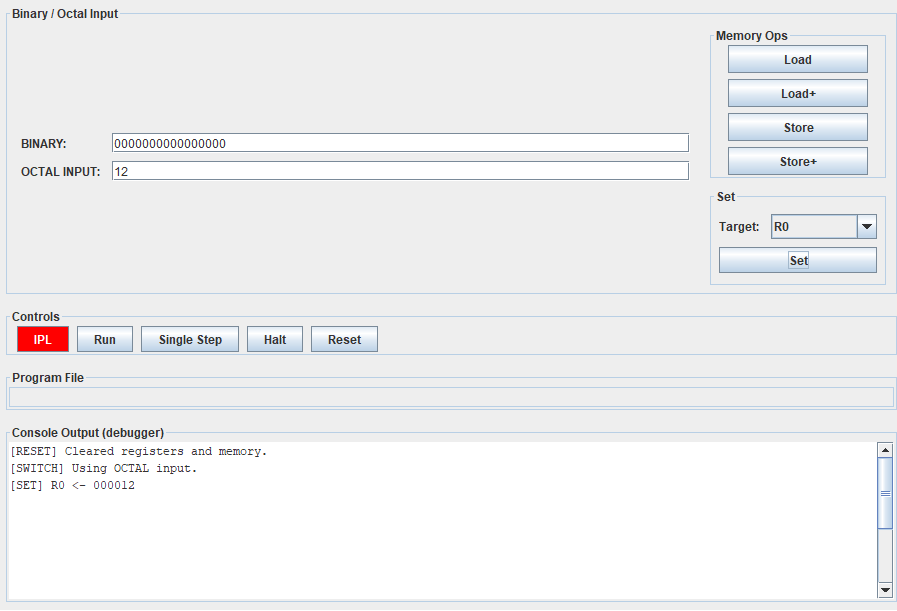
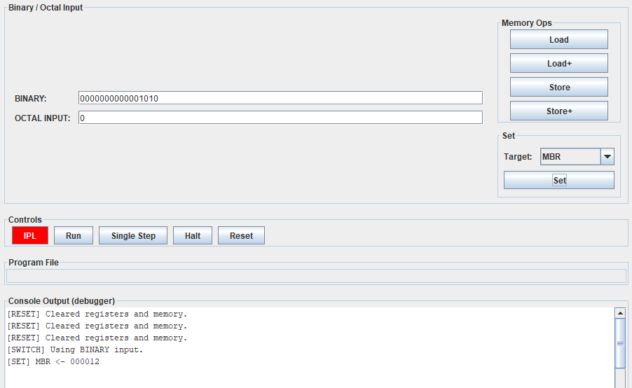
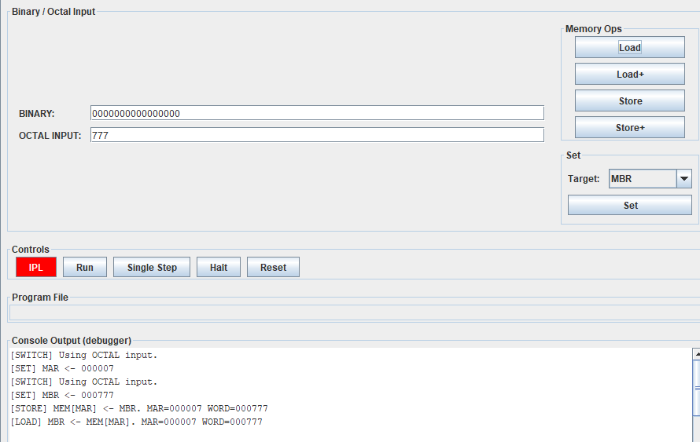
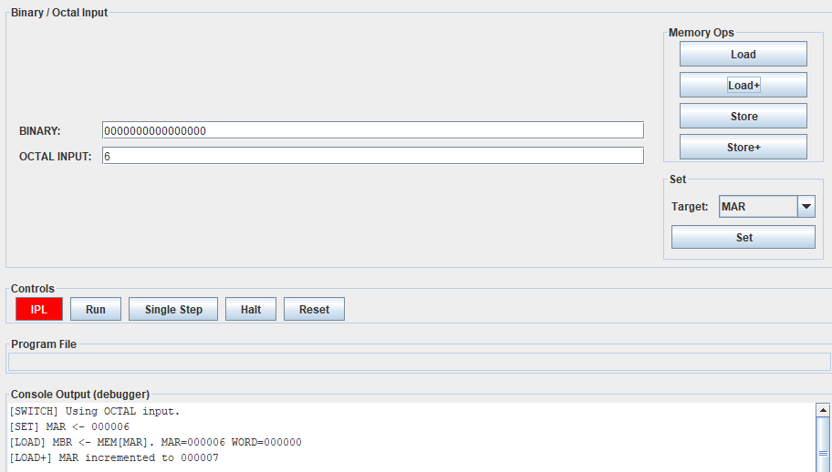
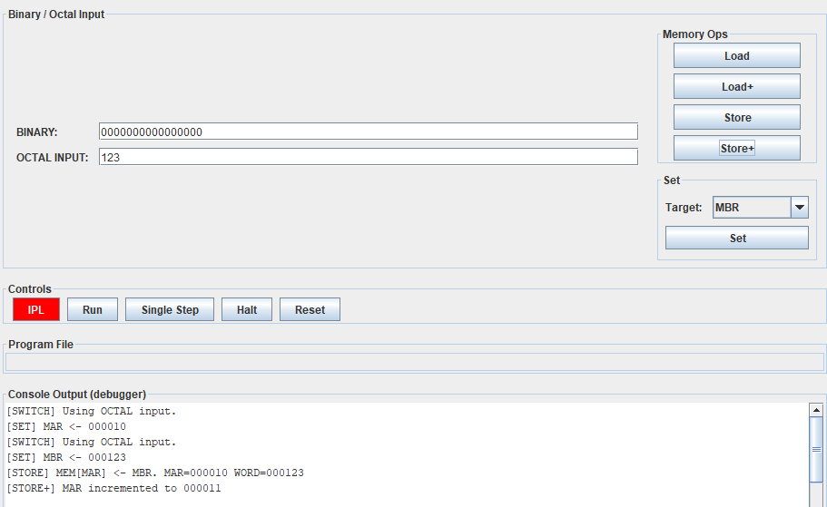
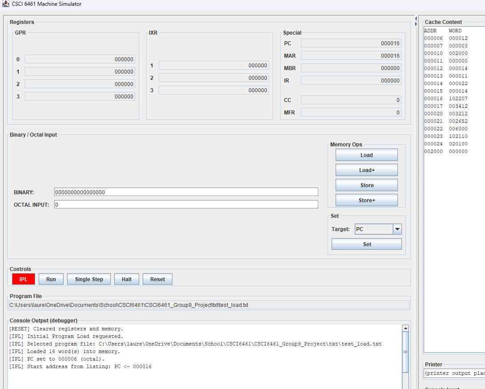
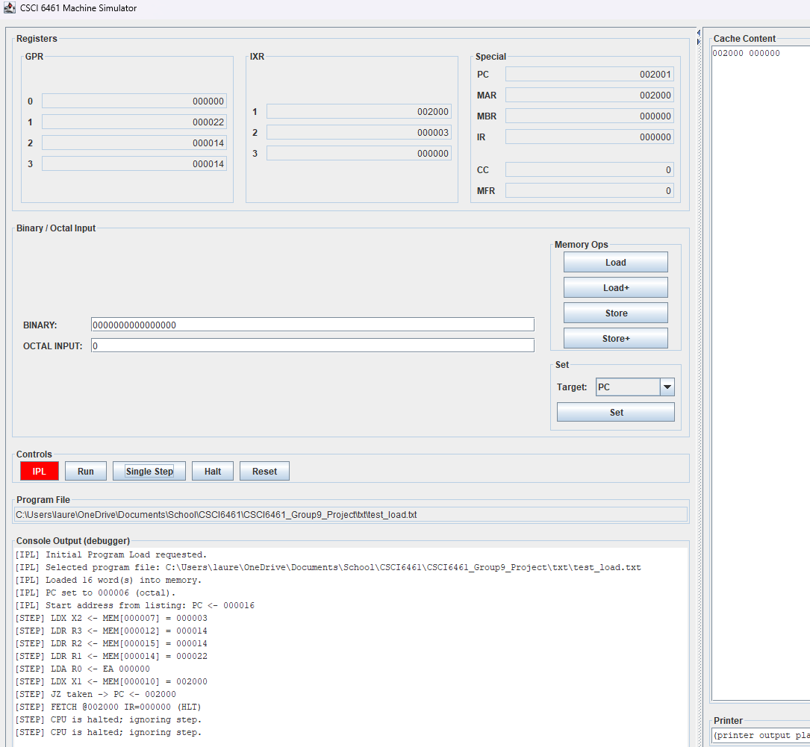
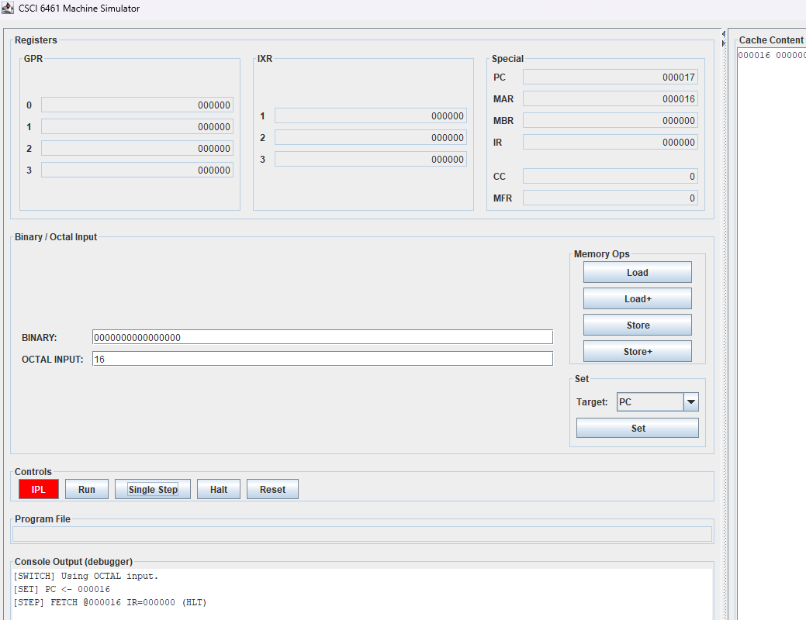

# Part 1 Test Cases — CSCI 6461 Machine Simulator (Group 9)

These test cases validate the Part 1 deliverables:
- Set values into registers (R0–R3 at minimum)
- Deposit/examine memory via switch inputs (Binary/Octal) + Load/Store controls
- IPL loads a short program and positions execution at program start
- Single Step executes instructions at PC
- Memory contents at MAR are shown on the console (Cache Content area)

## Conventions
- All register displays in the GUI are shown in **octal** (6 digits for words/addresses).
- The operator “switch” inputs are:
  - **BINARY**: 16-bit string (0/1 only)
  - **OCTAL INPUT**: octal digits (0–7)
- **Set Target** uses auto-detect:
  - If binary contains at least one `1`, binary is used
  - Otherwise octal is used (unless octal is empty)

---

## Test Case 1 — Reset clears registers and memory

**Precondition:** Simulator is running.

**Steps:**
1. Click **Reset**.

**Expected Result:**
- PC, MAR, MBR, IR become `000000`.
- R0–R3 become `000000`.
- X1–X3 become `000000`.
- Console Output contains a log entry indicating reset occurred.
- Cache Content is cleared (or shows no meaningful value).

---

## Test Case 2 — Set GPR using Octal input (R0)

**Precondition:** Simulator running (can be after Reset).

**Steps:**
1. In **OCTAL INPUT**, enter `12`.
2. In **Set Target**, select `R0`.
3. Click **Set**.

**Expected Result:**
- `R0` displays `000012`.
- Console Output shows:
  - `[SWITCH] Using OCTAL input.`
  - `[SET] R0 <- 000012`

---

## Test Case 3 — Set MBR using Binary input (binary override)

**Precondition:** Simulator running.

**Steps:**
1. In **BINARY**, enter `0000000000001010` (binary 10 decimal).
2. Ensure **OCTAL INPUT** is `0` (or any value).
3. In **Set Target**, select `MBR`.
4. Click **Set**.

**Expected Result:**
- MBR displays `000012` (octal for decimal 10).
- Console Output shows:
  - `[SWITCH] Using BINARY input.`
  - `[SET] MBR <- 000012`

---

## Test Case 4 — Deposit a value into memory via switches (Store)

**Precondition:** Simulator running.

**Steps:**
1. Set MAR:
   - OCTAL INPUT = `7`
   - Target = `MAR`
   - Click **Set**
2. Set MBR:
   - OCTAL INPUT = `777`
   - Target = `MBR`
   - Click **Set**
3. Click **Store**.
4. Click **Load** (verification readback).

**Expected Result:**
- After Store, Cache Content shows `000007 000777` (or displays mem at MAR containing 000777).
- Load sets MBR to `000777`.
- Console Output logs both Store and Load with MAR/WORD shown.

---

## Test Case 5 — Load+ increments MAR after loading

**Precondition:** Simulator running. (Memory may be IPL-loaded or manually set.)

**Steps:**
1. Set MAR:
   - OCTAL INPUT = `6`
   - Target = `MAR`
   - Click **Set`
2. Click **Load+**.

**Expected Result:**
- MBR becomes the word stored at `MEM[000006]`.
- MAR increments to `000007`.
- Console Output indicates both the load operation and MAR increment.

---

## Test Case 6 — Store+ increments MAR after storing

**Precondition:** Simulator running.

**Steps:**
1. Set MAR:
   - OCTAL INPUT = `10`
   - Target = `MAR`
   - Click **Set**
2. Set MBR:
   - OCTAL INPUT = `123`
   - Target = `MBR`
   - Click **Set**
3. Click **Store+**.

**Expected Result:**
- Memory at `000010` is updated to `000123`.
- MAR increments to `000011`.
- Cache Content shows the stored value at the MAR location (before or after increment depending on implementation).
- Console Output logs store + MAR increment.

---

## Test Case 7 — IPL loads program and sets PC to first instruction

**Precondition:** A load file exists at `txt/test_load.txt` (generated by the assembler).

**Steps:**
1. Click **Reset** (optional).
2. Click **IPL** (red button).
3. Select `txt/test_load.txt`.

**Expected Result:**
- Console Output logs:
  - selected file path
  - number of loaded words (e.g., 16)
  - PC set to start address derived from listing (typically `000016`)
- PC display becomes `000016` (octal).
- MAR is set to the same start address (if implemented that way).
- Cache Content shows a dump of loaded records or at least shows memory contents at MAR.

---

## Test Case 8 — Single Step executes through demo program and halts

**Precondition:** Program has been loaded via IPL (TC7).

**Steps:**
1. Click **Single Step** repeatedly (8–12 times).

**Expected Result:**
- Each click updates IR and logs the executed instruction (e.g., LDX, LDR, LDA, JZ).
- At the jump, console logs something like `JZ taken -> PC <- 002000`.
- At end, console logs `(HLT)` and CPU halts.
- Further Single Step presses log: `CPU is halted; ignoring step.`

---

## Test Case 9 — PC can be manually set and Single Step fetches/executes from that location

**Precondition:** Program loaded via IPL.

**Steps:**
1. In OCTAL INPUT, enter `16`.
2. Target = `PC`
3. Click **Set**
4. Click **Single Step** once.

**Expected Result:**
- PC becomes `000016` before stepping.
- After stepping, PC increments and IR reflects the instruction at `000016`.
- Console Output logs the executed instruction.
